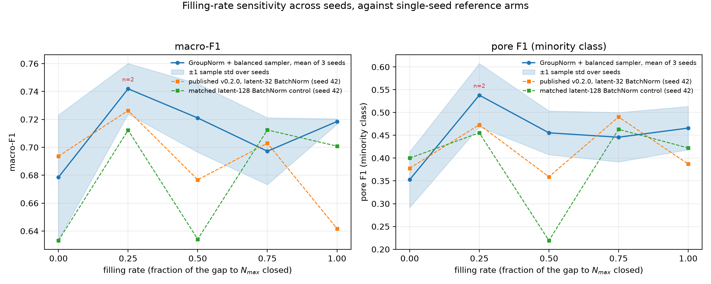
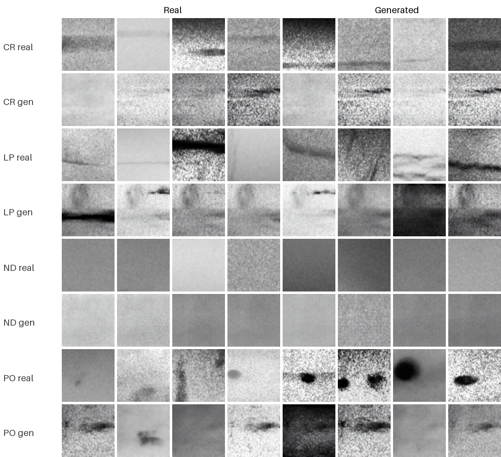
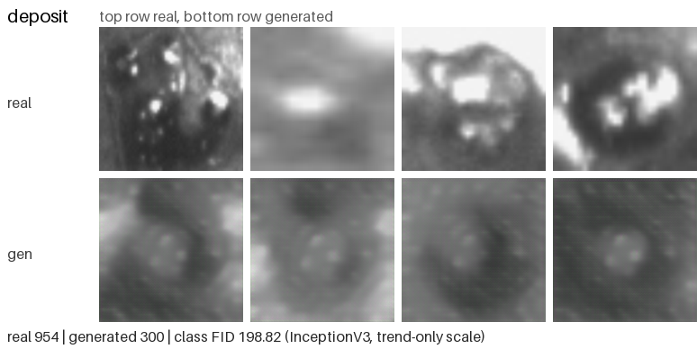
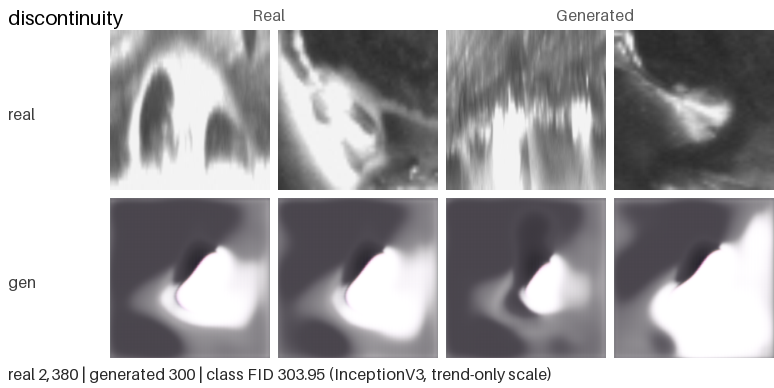
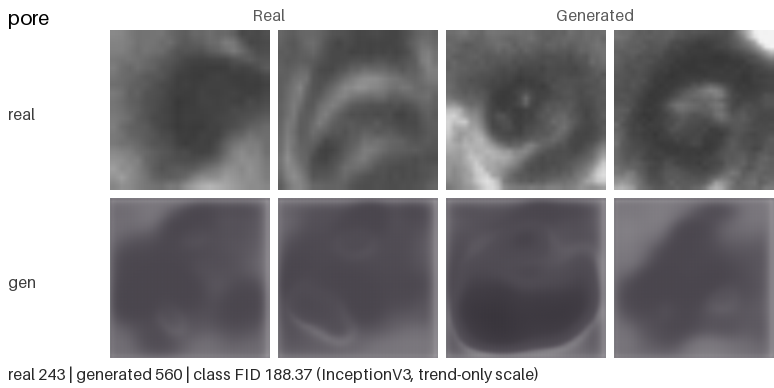
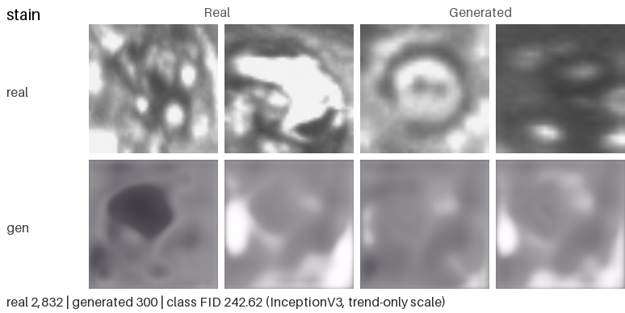

# Hybrid CVAE-CGAN for WAAM Defect Image Augmentation (Unofficial Reference Implementation)

**Language / 语言:** English | [中文](README_zh-CN.md)

[](LICENSE)
[](https://github.com/lijiawei255/hybrid-cvae-cgan-weld-augmentation/actions/workflows/smoke.yml)
[](https://www.python.org/)
[](https://pytorch.org/)
[](https://doi.org/10.1109/CYBER67662.2025.11168313)
[](https://doi.org/10.1016/j.ymssp.2026.114138)
[](https://doi.org/10.5281/zenodo.22660143)
[](CHANGELOG.md)

> The English README is normative. The Chinese translation (`README_zh-CN.md`) is
> maintained in sync with it; if the two ever diverge, the English version wins.

**Maintenance status: complete / as-is.** This repository is a completed
reference implementation. It is not actively developed. Issues may go
unanswered; please [fork](CONTRIBUTING.md) rather than wait for new features.
Fatal bugs in the published protocol may still be fixed.

Unofficial, completed reference implementation of Yang et al.'s hybrid
CVAE-CGAN protocol. Not affiliated with the authors. Use it to run the method
on public weld data; cite the original papers. This repository is not actively
developed.

> Junle Yang, Lei Yuan, Haochen Mu, Fengyang He, Donghong Ding, Zengxi Pan, Huijun Li, *"Generation of WAAM Defect Images Using a Hybrid CVAE-CGAN: A Data Augmentation Strategy for Small and Imbalanced Datasets"*, Proc. 15th IEEE Int. Conf. on CYBER Technology in Automation, Control, and Intelligent Systems (CYBER 2025), Shanghai, China, 15-18 July 2025. DOI: [10.1109/CYBER67662.2025.11168313](https://doi.org/10.1109/CYBER67662.2025.11168313)

Architecture and hyperparameter details that the conference paper omits are taken from the journal extension by the same first author:

> Junle Yang, Lei Yuan, Fengyang He, Zening Wu, Donghong Ding, Zengxi Pan, Huijun Li, *"Physics-guided generative data augmentation for vision-based signal processing under class-imbalanced conditions in directed energy deposition monitoring system"*, Mechanical Systems and Signal Processing, vol. 250, article 114138, 2026. **Open access (CC BY 4.0)**: DOI: [10.1016/j.ymssp.2026.114138](https://doi.org/10.1016/j.ymssp.2026.114138)

The method is a **single jointly-trained hybrid model**: one decoder is both
the CVAE decoder `D(z, y)` and the CGAN generator `G(z, y)`. Training minimises

```
L_G = MSE_recon  +  beta * KL  +  lambda * VGG19_perceptual  +  gamma * adversarial
```

Longer operating notes (journal-extension switches, own-data porting, layout,
limitations) live in [`docs/USAGE.md`](docs/USAGE.md). Measured deviations from
the papers live in [`docs/CALIBRATION.md`](docs/CALIBRATION.md).

## Quick facts

| | |
|---|---|
| **Task** | Class-conditional augmentation of small, imbalanced weld-defect image datasets |
| **Method** | Single jointly-trained hybrid CVAE-CGAN: one decoder is both `D(z, y)` and `G(z, y)`; MSE + KL + VGG19 perceptual + hinge adversarial (spectral norm) |
| **Data** | Public LoHi-WELD weld-bead crops (the papers used proprietary WAAM melt-pool imagery; results are not comparable) |
| **Entry points** | `smoke_test.py` -> `train_joint.py` -> `generate.py` -> `train_classifier.py` (+ `eval_fid.py`), all in `src/` |
| **Headline result** | Balance-to-max (r=1.0) macro-F1 0.7185 ± 0.0019 across three seeds, +0.0399 over the real-only mean (see [Results](#results---lohi-weld-current)) |
| **Status** | Complete / as-is; frozen reference implementation, v0.5.1 ([CHANGELOG](CHANGELOG.md)) |

## Contents

- [What this repository is and is not](#what-this-repository-is-and-is-not)
- [Scope at a glance](#scope-at-a-glance)
- [Disclaimer](#disclaimer)
- [Quickstart](#quickstart)
- [Data](#data)
- [Results - LoHi-WELD (current)](#results---lohi-weld-current)
- [License](#license)
- [How to cite](#how-to-cite)

## What this repository is and is not

This is a **from-scratch re-implementation of the hybrid CVAE-CGAN training
and augmentation protocol** described by Yang et al. The contribution is that
others need not reinvent the training loop or rediscover the calibration
pitfalls. Every deviation from the papers is measured in
[`docs/CALIBRATION.md`](docs/CALIBRATION.md).

It is **not** the original authors' code, a general-purpose image-generation
library, a living community scaffold, or a drop-in industrial tool. Absolute
numbers are tied to the public substitute data used here (LoHi-WELD) and to a
from-scratch ResNet-18 classifier. They are not comparable to the papers'
proprietary results.

## Scope at a glance

Read the five layers before quoting any number.

**Paper method (implemented).** Single-phase hybrid CVAE-CGAN: one decoder is
both `D(z, y)` and `G(z, y)`; combined MSE + KL + VGG19 perceptual +
adversarial loss; Sub-Pixel decoder; balance-to-max filling-rate sweep.

**This repo's adaptations.** PyTorch instead of TensorFlow/Keras. KL weight
rescaled to this repo's mean-normalised [0, 1] losses (`0.015` at latent 32,
`0.059` at latent 128, equivalent to the paper's `beta = 30`). Adversarial
term is hinge + spectral normalisation (journal extension), not conference
BCE. Encoder conv body is 4x4 stride-2 DCGAN blocks, not the papers' 3x3
residuals. Downstream classifier is a from-scratch ResNet-18 on single
frames. Default FID uses [pytorch-fid](https://github.com/mseitzer/pytorch-fid)
(official TensorFlow Inception weights). Published in-repo FID numbers used
the older torchvision path (`--fid_backend legacy`).

**Data inequivalence.** The papers train on proprietary visible-light
melt-pool images (1,898 images, 9 classes). This repo uses public LoHi-WELD
weld-bead crops and a simulated small/imbalanced `--subset`. Modality
matches; defect semantics, camera geometry and scale do not. The papers'
reported numbers cannot be externally verified because their dataset is
proprietary; every number in this repo is reproducible end-to-end from
public data.

**Not comparable to the papers.** Accuracy, F1, FID absolute values, and
DR/MDR. LoHi-WELD has no non-defect class, so DR/MDR are undefined here.

**Not fully reproduced.** Journal physics-guided losses; 21-frame temporal
augmentation and LSTM/GRU classifiers; paper residual encoder body; the
journal's Charbonnier reconstruction loss, Tanh decoder, projection
discriminator and free-bits KL; its 32-to-256 encoder widths; FFT denoising is
implemented but off by default. GroupNorm is available on every network via
`--d_norm` and `--g_norm` but only the discriminator's setting has been
measured. The full itemised list, including the choices this repo made where
the papers are ambiguous, is in
[`docs/USAGE.md`](docs/USAGE.md#what-this-repo-deliberately-does-not-reproduce).

## Disclaimer

- This repository is an **independent re-implementation based solely on the published paper**. It is **not affiliated with, endorsed by, or connected to the original authors or their institutions**.
- The original authors' WAAM dataset is proprietary and **was not used, accessed, or requested**.
- All experiments here run on **publicly available, openly licensed datasets**. Each dataset's own license applies.
- No **imagery** from the papers, and none of their proprietary data, is
  reproduced or claimed here. The journal extension is open access under
  [CC BY 4.0](https://creativecommons.org/licenses/by/4.0/), and
  [`docs/CALIBRATION.md`](docs/CALIBRATION.md) section 8 quotes its Fig. 15(a)
  ablation figures under that licence, with attribution, in order to explain
  which part of its headline result this repository does not reproduce.
  Short attributed quotations from the conference paper appear for the same
  reason.
- This project re-implements a *method*. It does **not** claim to reproduce the papers' experimental results or reported numbers.

## Quickstart

On a 12 GB GPU, the recommended 70-epoch generator on the paper-scale subset
is on the order of **one hour**. The five-ratio classifier sweep is typically
a few hours. The smoke test is minutes. See
[`docs/USAGE.md`](docs/USAGE.md#compute-order-of-magnitude) and the timing
table in [`docs/CALIBRATION.md`](docs/CALIBRATION.md) section 4.

Python 3.11 is the tested version (the one CI runs); other versions are
untested.

```bash
pip install -r requirements.txt

# Sanity check on synthetic data - run this after ANY code change.
python src/smoke_test.py

# Train the joint model (recommended LoHi-WELD configuration).
# --patience/--lr_patience 70 hold early stopping and LR decay off for the
# full 70 epochs, which is how the measured arm ran. At the defaults (10
# and 5) this run stops near epoch 32 and is a different generator.
python src/train_joint.py --data_root data/lohi \
  --subset "pore=40,deposit=150,discontinuity=300,stain=600" --val_per_class 200 \
  --epochs 70 --batch_size 8 --img_size 224 --channels 3 --latent_dim 128 \
  --lr 1e-3 --lr_d 1e-3 --kl_weight 0.059 --perc_weight 0.1 --adv_weight 0.1 \
  --patience 70 --lr_patience 70 --d_norm group --weighted_sampler \
  --fid_every 5 --sample_every 10 \
  --out_dir runs/joint_lohi_recommended

# Generate the balance-to-max pool.
python src/generate.py --ckpt runs/joint_lohi_recommended/joint.pt \
  --counts "pore=560,deposit=450,discontinuity=300,stain=0" --out_root generated

# Downstream sweep: one from-scratch classifier per filling rate.
# --selection final is the protocol behind every published table below;
# the current default, best_val, scores a different epoch.
python src/train_classifier.py --data_root data/lohi --gen_root generated \
  --subset "pore=40,deposit=150,discontinuity=300,stain=600" \
  --ratios "0.0,0.25,0.5,0.75,1.0" --channels 3 --epochs 100 \
  --selection final --out_dir runs/sweep

# Paper-style figures, from the two runs above. The committed figures come
# from the published runs instead - see the provenance table below.
python src/make_paper_figures.py --data_root data/lohi \
  --ckpt runs/joint_lohi_recommended/joint.pt \
  --history runs/joint_lohi_recommended/history.csv \
  --sweep runs/sweep/sweep_metrics.csv --cm_dir runs/sweep \
  --subset "pore=40,deposit=150,discontinuity=300,stain=600" --channels 3 \
  --out_dir results

# Standalone FID (default backend: pytorch-fid).
python src/eval_fid.py --real_root data/lohi --fake_root generated --channels 3
# Published in-repo FID numbers used:
#   python src/eval_fid.py --real_root data/lohi --fake_root generated --channels 3 --fid_backend legacy
```

Conference-paper defaults (latent 32, BatchNorm, no weighted sampler) are in
[`CHANGELOG.md`](CHANGELOG.md) under v0.2.0. Journal-extension switches,
porting to your own class-folder images, and the full limitations list:
[`docs/USAGE.md`](docs/USAGE.md).

## Data

Current experiments use **[LoHi-WELD](https://github.com/SylvioBlock/LoHi-Weld)**
(Block et al., IEEE Access 2024): visible-light weld-bead images, four defect
classes, free for research and commercial use with citation. After download,
prepare only `high_resolution_welds`:

```bash
python src/prepare_yolo_crops.py \
  --input_root <archive>/weld-dataset/high_resolution_welds \
  --out_root data/lohi --img_size 224 --channels 3 --min_side 16 \
  --classes "pore,deposit,discontinuity,stain"
```

This produces 8,012 crops (deposit 1,193, discontinuity 2,975, pore 304,
stain 3,540; imbalance ~11.6x). Headline runs use a small `--subset` of that
tree, not all 8,012 images. The 224x224 canvas overstates true resolution:
the median source box is ~47 px, so almost every crop is an upsample
(measured in [`docs/CALIBRATION.md`](docs/CALIBRATION.md) section 4).

No dataset is bundled. `data/`, `generated/`, `runs/` and `*.pt` are
git-ignored. Provenance and licenses: [`DATA_SOURCES.md`](DATA_SOURCES.md).
RIAWELC is a historical footnote only; its numbers live in
[`CHANGELOG.md`](CHANGELOG.md) (v0.1.0) and must not be quoted.

## Results - LoHi-WELD (current)

This section keeps the published v0.2.0 single-seed table as released; the
three-seed note below it (added in v0.3.0) is the current reading of the r=1.0
result.

Single seed (42). Generator: joint CVAE-CGAN on the paper-scale subset
(pore 40 / deposit 150 / discontinuity 300 / stain 600), 70 epochs with early
stopping at 25 (best epoch 15). Diagnostics: FID fell 371 -> 216 and plateaued
near 200 (diagnostic only, not comparable to any published FID); sample grids
show clear per-class morphology. At its best epoch this generator reaches
validation reconstruction MSE 0.0498 (training 0.0592) against the two trivial
predictors measured on its own 800-image validation split: a constant global
mean scores 0.0556 and each image's own mean scores 0.0339. So it beats the
constant-mean floor and does **not** reach the per-image-mean anchor, and only
6 of its 25 epochs are below the constant-mean floor at all. Earlier releases
quoted a 0.062 constant-mean baseline here; that value is corrected, and the
0.0556 / 0.0339 pair in [`docs/CALIBRATION.md`](docs/CALIBRATION.md) sections 6
and 9 is the right one.

**Filling-rate sweep** - one from-scratch ResNet-18 per ratio, 100 epochs each,
all evaluated on the same held-out real-only test set (1,603 images; the split
is crop-level - measured, 99.8-100% of test crops share a source frame with
the train pool, see the [limitations](docs/USAGE.md#limitations)):

| ratio | accuracy | macro-F1 | weighted-F1 | deposit | discontinuity | pore | stain |
|---|---|---|---|---|---|---|---|
| 0.00 (real only) | 0.8222 | 0.6936 | 0.8177 | 0.6521 | 0.9145 | 0.3778 | 0.8301 |
| **0.25** | **0.8353** | **0.7264** | **0.8306** | 0.6727 | 0.9203 | 0.4731 | 0.8393 |
| 0.50 | 0.8178 | 0.6767 | 0.8078 | 0.6108 | 0.9097 | 0.3590 | 0.8273 |
| 0.75 | 0.8141 | 0.7029 | 0.8064 | 0.5957 | 0.8977 | **0.4902** | 0.8281 |
| 1.00 (balance-to-max) | 0.7392 | 0.6418 | 0.7403 | 0.6199 | 0.7932 | 0.3871 | 0.7669 |

Both tables in this section were scored with `--selection final` and their FID
figures with `--fid_backend legacy`; today's defaults are `best_val` and
`pytorch_fid`, which are different protocols and different scales. **Repeating
an unchanged arm at the same seed moves pore F1 by 0.034 and macro-F1 by 0.009**
(measured, [`docs/CALIBRATION.md`](docs/CALIBRATION.md) section 10), so read any
single per-ratio difference smaller than that as noise - including the +0.009
macro-F1 at r=0.75 below.

Two findings, reported as measured:

1. **Augmentation helps the minority class.** pore (304 real crops) gains
   +0.095 F1 at r=0.25 and +0.112 at r=0.75; macro-F1 peaks at r=0.25 with
   +0.033 over the real-only baseline.
2. **The papers' balance-to-max recommendation does not transfer in this
   single-seed table.** r=1.0 is the worst ratio here. Treat "fill to N_max"
   as a hypothesis to test on your own data, not a default.

> **Finding 2 is partly superseded, and the table above is kept as published.**
> Across three independent generator/pool/classifier seeds, the recommended
> configuration (`--d_norm group --weighted_sampler`, `--latent_dim 128`,
> `--kl_weight 0.059`, full 70 epochs) gives r=1.0 macro-F1
> **0.7185 ± 0.0019**, +0.0399 over its 0.6785 ± 0.0447 real-only mean; its
> pore F1 is **0.4658 ± 0.0475**, +0.1132. This supports a positive *mean*
> r=1.0 effect, but not a monotone curve or a unique optimum there. The
> matched BatchNorm, unweighted-sampler control also has a positive r=1.0
> result, so GroupNorm and weighted sampling are **not required** for the
> sign flip. Full tables, the split-overlap measurement and limitations:
> [`docs/CALIBRATION.md`](docs/CALIBRATION.md) section 9.

Figures in `results/`. **Each one belongs to a specific run**, and only the
first row is regenerable from what this repository ships - the rest need a
generator checkpoint or per-ratio confusion matrices from the original run
directories, which are git-ignored (see [Reproducibility](#reproducibility)):

| figure | run it was produced from |
|---|---|
| `filling_rate_multiseed.png` | the three-seed GroupNorm + balanced-sampler sweep above |
| `filling_rate_curve.png` | the published v0.2.0 single-seed sweep (`runs/sweep`) |
| `training_curves.png`, `reconstruction_comparison.png`, `latent_tsne.png` | the published v0.2.0 generator (`runs/joint_lohi`) |
| `confusion_matrices.png` (r=0 vs r=1), `class_distribution.png` | the published v0.2.0 sweep |
| `real_vs_generated.png`, `class_*.png` | the recommended `runs/paper2_gn_wrs` generator |

Reproduce commands for the first and last rows: `docs/CALIBRATION.md` section 9.
The raw metric exports behind these figures (sweep and training-history CSVs)
are published under [`results/metrics/`](results/metrics/README.md), one
subdirectory per run name, so the CSV-only figures reproduce without the
original run directories.

### Reproducibility

What ships in this repository, and what does not:

| artefact | shipped? | what it means for you |
|---|---|---|
| every metric behind every published number | yes, `results/metrics/` | the tables can be checked without a GPU |
| per-ratio confusion matrices (`cm_r*.npy`) | yes, `results/metrics/` | `confusion_matrices.png` redraws without retraining |
| generator checkpoints (`joint.pt`) | no, too large for git | published as assets on the Zenodo record; otherwise retrain |
| generated image pools | no | regenerate from a checkpoint with `src/generate.py` |
| LoHi-WELD itself | no | download it and run `src/prepare_yolo_crops.py` |

Exact environment: `requirements.txt` gives the supported ranges and
`requirements-lock.txt` pins the versions these results were produced with.
GPU results are not bit-reproducible even at a fixed seed
([`docs/CALIBRATION.md`](docs/CALIBRATION.md) section 10).



The band is ±1 sample standard deviation over the three seeds; `n=2` marks
r=0.25, where the seed-42 arm is excluded for a final-epoch loss spike. The
figure supports the r=1.0 reading, not a ratio-by-ratio ranking of the three
configurations.

**Committed LoHi-WELD showcase.** Qualitative examples from the recommended
generator, `runs/paper2_gn_wrs/joint.pt`. Per-class FID on the close-ups is an
intra-repo diagnostic, not a literature-comparable score. Earlier v0.2.0
versions are kept as `results/v0.2.0_*.png`.



| deposit | discontinuity |
|---|---|
|  |  |
| pore | stain |
|  |  |

Published tables used `--selection final`. The current classifier default is
`--selection best_val`. The downstream model is a from-scratch ResNet-18 on
single frames, not the papers' LSTM/GRU. Full caveats:
[`docs/USAGE.md`](docs/USAGE.md#limitations) and
[`docs/CALIBRATION.md`](docs/CALIBRATION.md) section 10.

## License

Code: [MIT](LICENSE). The default FID backend depends on
[pytorch-fid](https://github.com/mseitzer/pytorch-fid) (Apache-2.0); see
[NOTICE](NOTICE). Third-party datasets remain under their own licenses.
The committed figures in `results/` are derived from LoHi-WELD imagery, so
they stay subject to that dataset's citation requirement as well.

## How to cite

If this re-implementation helps your work, cite the **original papers** and the
**datasets** rather than this repo. [`CITATION.cff`](CITATION.cff) lists two
groups: the reproduced papers plus every dataset's required citations, and the
implementation-component references (FID, t-SNE, InceptionV3, ResNet-18,
VGG19). Versioned snapshots of this repository are archived on Zenodo:
[10.5281/zenodo.22660143](https://doi.org/10.5281/zenodo.22660143).

```bibtex
% --- Primary method reference (conference paper being re-implemented) ---
@inproceedings{yang2025hybridcvaecgan,
  title     = {Generation of WAAM Defect Images Using a Hybrid CVAE-CGAN:
               A Data Augmentation Strategy for Small and Imbalanced Datasets},
  author    = {Yang, Junle and Yuan, Lei and Mu, Haochen and He, Fengyang and
               Ding, Donghong and Pan, Zengxi and Li, Huijun},
  booktitle = {Proc. 15th IEEE International Conference on CYBER Technology
               in Automation, Control, and Intelligent Systems (CYBER 2025)},
  address   = {Shanghai, China},
  month     = jul,
  year      = {2025},
  pages     = {1--6},
  doi       = {10.1109/CYBER67662.2025.11168313}
}

% --- Secondary method reference (journal extension; supplies the details
% --- the conference paper omits). Open access under CC BY 4.0. ---
@article{yang2026physicsguided,
  title   = {Physics-guided generative data augmentation for vision-based
             signal processing under class-imbalanced conditions in directed
             energy deposition monitoring system},
  author  = {Yang, Junle and Yuan, Lei and He, Fengyang and Wu, Zening and
             Ding, Donghong and Pan, Zengxi and Li, Huijun},
  journal = {Mechanical Systems and Signal Processing},
  volume  = {250},
  pages   = {114138},
  year    = {2026},
  doi     = {10.1016/j.ymssp.2026.114138}
}

% --- Both RIAWELC citations below are mandatory usage terms of the dataset ---
@inproceedings{totino2022riawelc,
  title     = {RIAWELC: A Novel Dataset of Radiographic Images for
               Automatic Weld Defects Classification},
  author    = {Totino, Benito and Spagnolo, Fanny and Perri, Stefania},
  booktitle = {Proc. Interdisciplinary Conference on Mechanics, Computers
               and Electrics (ICMECE 2022)},
  address   = {Barcelona, Spain},
  month     = oct,
  year      = {2022}
}

@article{perriweldingdefects,
  title   = {Welding Defects Classification Through a Convolutional
             Neural Network},
  author  = {Perri, Stefania and Spagnolo, Fanny and Frustaci, Fabio and
             Corsonello, Pasquale},
  journal = {Manufacturing Letters},
  volume  = {35},
  pages   = {29--32},
  year    = {2023},
  doi     = {10.1016/j.mfglet.2022.11.006}
}

% --- Visible-light weld defect dataset intended as the primary experiment ---
@article{block2024lohiweld,
  title   = {LoHi-WELD: A Novel Industrial Dataset for Weld Defect Detection
             and Classification, a Deep Learning Study, and Future
             Perspectives},
  author  = {Block, Sylvio Biasuz and Dutra da Silva, Ricardo and
             Lazzaretti, Andre Eugenio and Minetto, Rodrigo},
  journal = {IEEE Access},
  volume  = {12},
  pages   = {77442--77453},
  year    = {2024},
  doi     = {10.1109/ACCESS.2024.3407019}
}
```
