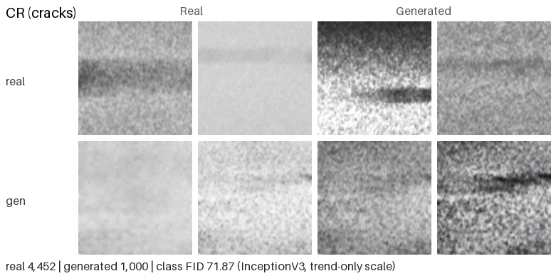
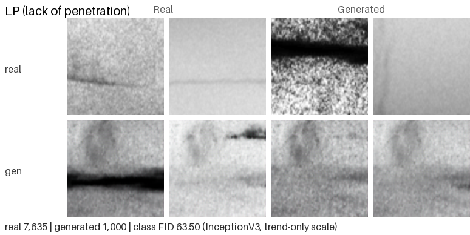
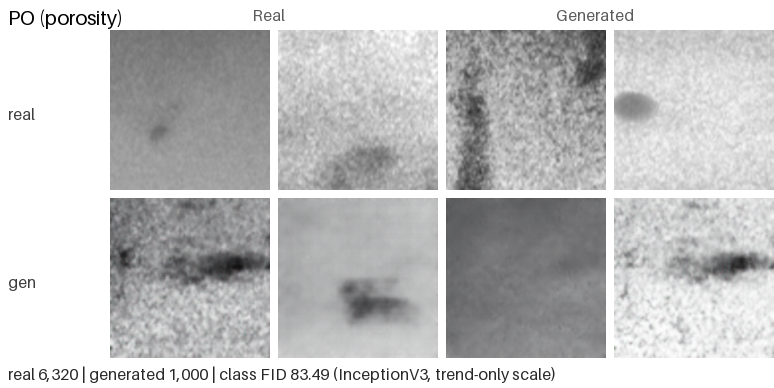
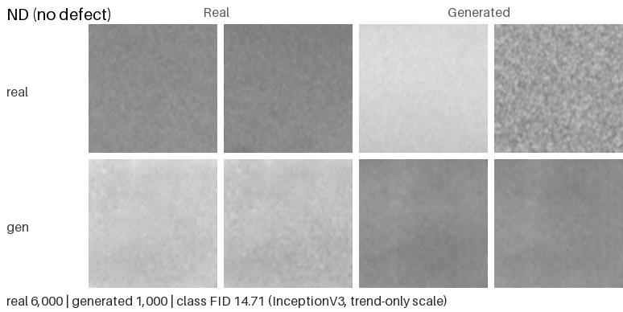

# Hybrid CVAE-CGAN for WAAM Defect Image Augmentation (Unofficial Re-implementation)

**Language / 语言:** English | [中文](README_zh-CN.md)

> The English README is normative. The Chinese translation (`README_zh-CN.md`) is
> maintained in sync with it; if the two ever diverge, the English version wins.

An **unofficial, method-level re-implementation attempt** of the hybrid CVAE-CGAN framework proposed in:

> Junle Yang, Lei Yuan, Haochen Mu, Fengyang He, Donghong Ding, Zengxi Pan, Huijun Li, *"Generation of WAAM Defect Images Using a Hybrid CVAE-CGAN: A Data Augmentation Strategy for Small and Imbalanced Datasets"*, Proc. 15th IEEE Int. Conf. on CYBER Technology in Automation, Control, and Intelligent Systems (CYBER 2025), Shanghai, China, 15-18 July 2025. DOI: [10.1109/CYBER67662.2025.11168313](https://doi.org/10.1109/CYBER67662.2025.11168313)

Architecture and hyperparameter details that the conference paper omits are taken from the journal extension by the same first author:

> Junle Yang, Lei Yuan, Fengyang He, Zening Wu, Donghong Ding, Zengxi Pan, Huijun Li, *"Physics-guided generative data augmentation for vision-based signal processing under class-imbalanced conditions in directed energy deposition monitoring system"*, Mechanical Systems and Signal Processing, vol. 250, article 114138, 2026. **Open access (CC BY 4.0)**: DOI: [10.1016/j.ymssp.2026.114138](https://doi.org/10.1016/j.ymssp.2026.114138)

If this repository is useful to you, please cite **those original papers** rather than this repo - they are the source of the method, and this re-implementation exists to point people toward them.

This repo exists as a **public reference for anyone attempting a similar
reproduction**: it documents what was re-implemented from the paper, which
public substitute dataset was used, and where the implementation diverges
from the original.

The method generates class-conditional weld defect images to augment small and
imbalanced datasets. It is a **single jointly-trained hybrid model**, not a
two-stage pipeline: one decoder acts as the CVAE decoder `D(z, y)` and as the
CGAN generator `G(z, y)` at the same time, which is what "hybrid" means here.
Training minimises a combined objective

```
L_G = MSE_recon  +  beta * KL  +  lambda * VGG19_perceptual  +  gamma * adversarial
```

with the generator and discriminator updated alternately inside each minibatch
using separate backward passes. The KL term shapes the latent space toward
`N(0, I)` so that sampling `z ~ N(0, I)` with a class label works at generation
time; the perceptual and adversarial terms sharpen what a pure VAE would leave
blurry.

## Disclaimer

- This repository is an **independent re-implementation based solely on the published paper**. It is **not affiliated with, endorsed by, or connected to the original authors or their institutions**.
- The original authors' WAAM dataset is proprietary and **was not used, accessed, or requested** for this project.
- All experiments here run on **publicly available, openly licensed datasets** (see `DATA_SOURCES.md`). Each dataset's own license applies; attribution notices are kept in the data download instructions.
- No figures, tables, or text from the paper are reproduced in this repository.
- This project re-implements a *method*, and does **not** claim to reproduce the paper's experimental results or reported numbers.

## Quickstart

```bash
pip install -r requirements.txt

# Sanity check on synthetic data - run this after ANY code change.
python src/smoke_test.py

# Train the joint model. --subset is keyed by class NAME and defines the small
# imbalanced training set; the held-out test split is carved off first, so the
# generator never sees it.
python src/train_joint.py --data_root data/lohi \
  --subset "pore=40,deposit=150,discontinuity=300,stain=600" --val_per_class 200 \
  --epochs 70 --batch_size 8 --img_size 224 --channels 3 --latent_dim 32 \
  --lr 1e-3 --lr_d 1e-3 --kl_weight 0.015 --perc_weight 0.1 --adv_weight 0.1 \
  --out_dir runs/joint_lohi

# Generate the balance-to-max pool: what filling rate 1.0 needs per class.
# Class names are read from the checkpoint and verified, never assumed.
python src/generate.py --ckpt runs/joint_lohi/joint.pt \
  --counts "pore=560,deposit=450,discontinuity=300,stain=0" --out_root generated

# Downstream sweep: one from-scratch classifier per filling rate, every run
# evaluated on the same held-out real test set.
python src/train_classifier.py --data_root data/lohi --gen_root generated \
  --subset "pore=40,deposit=150,discontinuity=300,stain=600" \
  --ratios "0.0,0.25,0.5,0.75,1.0" --channels 3 --epochs 100 --out_dir runs/sweep

# Paper-style figures (training curves, filling-rate sensitivity, latent t-SNE,
# real/reconstruction/generated, confusion matrices, class distribution).
python src/make_paper_figures.py --data_root data/lohi \
  --ckpt runs/joint_lohi/joint.pt --history runs/joint_lohi/history.csv \
  --sweep runs/sweep/sweep_metrics.csv --cm_dir runs/sweep \
  --subset "pore=40,deposit=150,discontinuity=300,stain=600" --channels 3 \
  --out_dir results

# Standalone FID between two image trees.
python src/eval_fid.py --real_root data/lohi --fake_root generated --channels 3
```

### Switches taken from the journal extension

The Quickstart above reproduces the *conference* paper's configuration. Four
`train_joint.py` switches implement components that appear only in the journal
extension (MSSP 2026). All four default to the conference-paper behaviour, so
nothing changes unless you ask for it.

| switch | default | journal-extension value | status |
|---|---|---|---|
| `--d_norm` | `batch` | `group` | measured, recommended |
| `--weighted_sampler` | off | on | measured, recommended |
| `--kl_warmup` | off (constant beta) | `10,50` | implemented and unit-tested, **not training-validated** |
| `--monitor` | `val_loss` | - | only needed together with `--kl_warmup` |

- `--d_norm group` replaces the discriminator's BatchNorm with GroupNorm. At
  `--batch_size 8` BatchNorm makes a sample's score depend on its seven batch
  neighbours; GroupNorm normalises within each sample. Measured effect: the
  discriminator's hinge loss moves from a median of 0.819 (a dominant
  discriminator) to 1.998, matching the journal paper's report that it "settles
  to an approximately constant value around 2.0".
- `--weighted_sampler` draws training batches with `WeightedRandomSampler`,
  weight proportional to `1/N_class`. `--subset` caps per-class counts but does
  **not** balance batches: a 40-image minority class inside a 1,090-image subset
  is 3.7% of draws, so at batch size 8 most minibatches contain no minority
  sample at all.
- `--kl_warmup ZERO,RAMP` keeps beta at 0 for `ZERO` epochs then ramps linearly
  to `--kl_weight` over `RAMP` epochs. It needs the journal paper's 200-epoch
  protocol to mean anything; inside a 70-epoch run only 10 epochs would execute
  at full beta, so it is deliberately not trained here.
- `--monitor val_recon` selects the best checkpoint on reconstruction MSE alone.
  Required under `--kl_warmup`, because the total loss includes `beta * KL` and
  therefore changes meaning as beta ramps.

Enabling `--d_norm group --weighted_sampler` together is the configuration
measured in `docs/CALIBRATION.md` section 9. Read the two qualifications there
before reusing the numbers: that arm changed both variables at once, so neither
effect is separately attributed, and its FID got worse while its reconstruction
improved.

### Using your own dataset

Point `--data_root` at a folder of class subfolders. Nothing else is
dataset-specific:

- Class identity is expressed **by name** everywhere (`--subset`, `--counts`),
  and every name is validated against the dataset or checkpoint. An unknown or
  misspelled class raises instead of silently selecting the wrong one.
- Choose `--subset` counts from your own per-class counts. The method targets
  *small and imbalanced* data, so pick a minority count low enough that the task
  is not already solved, and set the majority count to the `N_max` you want
  balance-to-max to fill up to.
- `--channels 3` works for colour data; `--img_size` must be divisible by 16.
- `--fft_denoise` enables the paper's FFT low-pass preprocessing. It is off by
  default, and measured to be a near no-op on both datasets used here. RIAWELC's
  radiographs are already band-limited. LoHi-WELD's crops put 99.2-99.9% of their
  spectral energy inside normalised radius 0.1, so at the paper's `cutoff = 0.25`
  the filter retains **0.0%** of the mid-band where defect edges live and changes
  the image by an MSE of 3-14 on the [0, 255] scale, out of a possible 65,025.
  It is inert there because the crops are upsamples of small source boxes, and
  upsampling cannot create high-frequency content - so what the filter mostly
  does is make the *target* smoother. Any apparent gain from it should be read as
  "the task got easier", not "the method got stronger". See
  `docs/CALIBRATION.md` section 3. Turn it on if your own imagery carries genuine
  high-frequency sensor noise, and pass it to `src/eval_fid.py` too, or FID will
  measure the preprocessing mismatch instead of generation quality.
- `--kl_weight` must be rescaled if you change the loss normalisation. See
  `models.cvae_loss` and the derivation in `CHANGELOG.md`.

## Results - v0.2.0 (LoHi-WELD, current)

Single seed (42). Generator: joint CVAE-CGAN on the paper-scale subset
(pore 40 / deposit 150 / discontinuity 300 / stain 600), 70 epochs with early
stopping at 25 (best epoch 15). Diagnostics: FID fell 371 -> 216 and plateaued
near 200 (diagnostic only, not comparable to any published FID); reconstruction
MSE 0.049-0.060 against a constant-mean baseline of 0.062; sample grids show
clear per-class morphology.

**Filling-rate sweep** - one from-scratch ResNet-18 per ratio, 100 epochs each,
all evaluated on the same held-out real-only test set (1,603 images):

| ratio | accuracy | macro-F1 | weighted-F1 | deposit | discontinuity | pore | stain |
|---|---|---|---|---|---|---|---|
| 0.00 (real only) | 0.8222 | 0.6936 | 0.8177 | 0.6521 | 0.9145 | 0.3778 | 0.8301 |
| **0.25** | **0.8353** | **0.7264** | **0.8306** | 0.6727 | 0.9203 | 0.4731 | 0.8393 |
| 0.50 | 0.8178 | 0.6767 | 0.8078 | 0.6108 | 0.9097 | 0.3590 | 0.8273 |
| 0.75 | 0.8141 | 0.7029 | 0.8064 | 0.5957 | 0.8977 | **0.4902** | 0.8281 |
| 1.00 (balance-to-max) | 0.7392 | 0.6418 | 0.7403 | 0.6199 | 0.7932 | 0.3871 | 0.7669 |

Two findings, reported as measured:

1. **Augmentation helps the minority class.** pore (304 real crops, the scarce
   class) gains +0.095 F1 at r=0.25 and +0.112 at r=0.75; macro-F1 peaks at
   r=0.25 with +0.033 over the real-only baseline. This is the method's core
   claim, demonstrated on a public dataset.
2. **The papers' balance-to-max recommendation does not transfer here.** r=1.0 is
   the *worst* ratio (macro-F1 0.642, below the 0.694 baseline), whereas the
   journal extension reports monotone improvement peaking at 1.0. The likely
   cause is generator fidelity: at r=1.0 roughly half the training set for three
   classes is synthetic, and our samples are blurrier than the papers', so
   flooding dilutes the real signal instead of reinforcing it. Treat
   "fill to N_max" as a hypothesis to test on your own data, not a default.

> **Finding 2 is partly superseded, and the table above is kept as published.**
> Re-running the sweep with the journal extension's configuration
> (`--d_norm group --weighted_sampler`, `--latent_dim 128`, `--kl_weight 0.059`,
> the full 70 epochs) **reverses it at r=1.0**: that ratio becomes the *best* on
> the curve, macro-F1 0.7168 against this arm's own 0.6848 real-only baseline
> (+0.032), with pore F1 0.5053 against the published 0.3871 (+0.118). Over the
> four ratios that completed cleanly the curve is monotone increasing
> (0.6848 -> 0.6932 -> 0.7102 -> 0.7168), which is the shape the journal paper
> reports and the shape the v0.2.0 curve did not have. The r=0.25 arm of the new
> sweep is **not a measurement**: its loss spiked three orders of magnitude at the
> final epoch and the classifier scores the final epoch.
>
> Do not read this as "GroupNorm fixed balance-to-max". The new configuration
> differs from v0.2.0 in five respects at once, and the matched control - the
> latent-128 BatchNorm arm in `runs/probe_eq_g0.1` - has not been swept, so the
> reversal cannot yet be attributed to either switch. It is also a single seed,
> against a measured run-to-run spread of 0.034 pore F1. Full numbers, both
> tables and all four caveats: `docs/CALIBRATION.md` section 9.

Figures in `results/`: `filling_rate_curve.png` (the sweep above),
`training_curves.png` (loss components and FID per epoch),
`reconstruction_comparison.png` (real / reconstruction / generated),
`latent_tsne.png` (encoder latent projection), `confusion_matrices.png`
(r=0 vs r=1), `class_distribution.png`, plus per-class close-ups
(`class_*.png`) and the real-vs-generated grid (`real_vs_generated.png`).

**Caveats.** Single seed, and the classifier is not bit-reproducible on GPU:
`train_classifier.py` seeds every RNG but never enables deterministic CUDA
algorithms, so a repeat of the *unchanged* real-only arm at the same seed moved
pore F1 by 0.034 and macro-F1 by 0.009. Treat differences below that as noise,
in either direction - the earlier "~0.02 macro-F1" guess in this paragraph was
too optimistic for the minority class, which is scored on only 61 test images.
It also evaluates the **final** epoch at a constant learning rate, with no
early stopping and no best-epoch selection, so a late loss spike can invalidate
one arm outright. Both are measured and explained in `docs/CALIBRATION.md`
section 10. Separately, the downstream classifier is a from-scratch ResNet-18
over single images, not the papers' LSTM/GRU over 21-frame sequences, so absolute
scores are not comparable to the papers'. See the limitations list above for the
rest of the calibration record.

## Results - v0.1.0 (superseded, do not quote)

> **These numbers come from the deleted two-stage skeleton running on the full
> dataset, which is not the protocol this repo now follows.** The FID values are
> additionally **invalid**: they were computed by feeding [0, 1] images to
> InceptionV3 with `transform_input=False`, which expects [-1, 1], so every
> activation was off-distribution. They are not comparable to literature FIDs,
> to each other across that fix, or to the current results. They are kept only
> because v0.1.0 was published with them. See `CHANGELOG.md`.

Single-seed runs on the full RIAWELC dataset (24,407 images, 128x128, batch
64). These numbers describe *this* re-implementation on a substitute dataset
and are **not** comparable to the original paper's results.

| Stage | Setting | Result |
|---|---|---|
| Stage 1 CVAE | 100 epochs, latent dim 128 | final L1 recon 0.102, KL ~7.0 |
| Stage 2 CGAN | 200 epochs, G initialized from the CVAE decoder | final D loss 0.38, no mode collapse |
| FID (InceptionV3) | 24,407 real vs 4,000 generated | 37.96 |

Downstream augmentation-gain experiment (pretrained ResNet-18, stratified
80/20 real-only test split, seed 42): condition A = imbalanced real subset
(20% of each defect class kept, ~7.7k images), condition B = A + 1,000
generated images per defect class (~10.7k). Both conditions reach ~99.4%
test accuracy (macro-F1 0.9931 vs 0.9932) — **no measurable augmentation
gain on this dataset**: the ImageNet-pretrained classifier solves RIAWELC
almost perfectly even in the imbalanced baseline, so the task saturates and
leaves no headroom for augmentation to help. The paper's setting (1,898
proprietary melt-pool images, as few as 36 samples per class) is far harder;
demonstrating a gain would need a harder substitute task. This negative
result is reported as-is. Protocol notes: `src/train_classifier.py`; the
generator was trained on all real images, so generated data may carry
information about test images (same protocol limitation as the paper).

Real vs. generated samples per class (upper row real, lower row generated):


Per-class close-ups (top row real, bottom row generated; the number in each
caption is that class's FID — lower is better; the normalization is
non-standard, so compare classes only against each other, not against
literature values):

| CR (cracks), FID 71.9 | LP (lack of penetration), FID 63.5 |
|---|---|
|  |  |
| **PO (porosity), FID 83.5** | **ND (no defect), FID 14.7** |
|  |  |


## Repository layout

```
src/models.py             encoder, decoder (= generator), discriminator, losses
src/data.py               class-folder loader, FFT denoising, leakage-free splits
src/augment.py            balance-to-max filling-rate protocol
src/prepare_yolo_crops.py detection-format datasets -> class-folder crops (+ ROI step)
src/train_joint.py        joint CVAE-CGAN training (the paper's single phase)
src/generate.py           class-conditional sampling, counts by class name
src/eval_fid.py           FID (InceptionV3 features) + input normalisation
src/train_classifier.py   downstream filling-rate sweep (from-scratch ResNet-18)
src/make_paper_figures.py training curves, sensitivity curve, t-SNE, confusions
src/make_comparison.py    real-vs-generated comparison grid into results/
src/make_class_figures.py compact per-class close-ups with per-class FID
src/smoke_test.py         unit checks + end-to-end run on synthetic data
```

## Data

Current experiments use **[LoHi-WELD](https://github.com/SylvioBlock/LoHi-Weld)**
(Block et al., IEEE Access 2024): 3,022 **visible-light** weld-bead images with
four defect classes, released for free research and commercial use with
citation. Like the reproduced papers' melt-pool imagery it is visible-light, and
its high-resolution beads crop to 8,012 defect patches with an **11.6x** class
imbalance - close to the conference paper's 14.7x.

It ships as detection data (image + YOLO label pairs), so
`src/prepare_yolo_crops.py` crops each annotated box into class folders; that
crop is also the papers' ROI-extraction preprocessing step. See
`DATA_SOURCES.md` for the exact preparation command, per-class counts, and the
license terms.

**RIAWELC** (X-ray radiographs) was used by v0.1.0 and by the generator
calibration record, and is now a historical footnote only - no current number
derives from it. Its citation is retained because those already-public results
used it. See `DATA_SOURCES.md`.

No dataset is bundled here, and none should ever be committed - `data/`,
`generated/`, `runs/` and `*.pt` are git-ignored by design. See
`DATA_SOURCES.md` for download links, usage terms, and license-clean
alternatives.

## Limitations and honest caveats

Read this before quoting any number from this repo.

- **Different data, same modality.** The papers trained on proprietary
  visible-light melt-pool imagery (1,898 images, 9 classes, up to 14.7x
  imbalance). This repo uses public LoHi-WELD visible-light weld beads, so the
  *modality* now matches, but defect semantics, camera geometry and scale still
  differ. No result here reproduces or validates the papers' numbers.
- **The "small and imbalanced" condition is simulated.** LoHi-WELD's 8,012
  crops at 11.6x imbalance are larger and milder than the papers' setting, so
  the headline experiment draws a small imbalanced subset
  (`--subset "pore=40,deposit=150,discontinuity=300,stain=600"`, 15x imbalance,
  balance-to-max target 600) to recreate the papers' conditions. Those counts
  are a parameter you should set from your own dataset, not a property of the
  method.
- **The downstream classifier is not the papers' classifier.** Both papers
  evaluate LSTM/GRU models over 21-frame temporal sequences. Static weld-bead
  images have no temporal axis, so sequences cannot be constructed; a
  from-scratch ResNet-18 over single images is substituted, honouring the
  papers' stated preference for lightweight non-pretrained models. Accuracy and
  F1 values are
  therefore not comparable to the papers' - only the protocol is.
- **FID is a trend indicator here, not an absolute score.** Different dataset,
  resolution and reference set from any published FID. Compare curves within this
  repo, never across repos.
- **Four hyperparameters were calibrated, not copied.** The KL weight (0.015 vs
  the paper's 30), the discriminator learning rate, the FFT denoising step (off),
  and the resolution (224 vs 400) each differ from the conference paper for
  measured reasons. The adversarial objective follows the **journal extension**
  (hinge + spectral normalisation) rather than the conference paper's BCE
  minimax, because the unbounded BCE term destroyed reconstruction at this data
  scale. Evidence and reproduction commands:
  [`docs/CALIBRATION.md`](docs/CALIBRATION.md).
- **Single seed.** Every reported number is one run at seed 42. GAN training at
  this scale is noisy; treat differences under a few points as within noise.
- **Leakage-free by construction.** The generator never sees the classifier's
  held-out test images. This is stricter than strictly necessary and is the
  honest reading of the papers' "real, unseen images"; it also means the reported
  gain, if any, is not inflated by test-set information.

### Scope: what this repo deliberately does NOT reproduce

- **The journal extension's physics-guided generation is out of scope.** Its
  contribution beyond the conference paper is thermodynamic/boundary constraints
  on the generated melt-pool signal. Static weld images carry no thermal or
  temporal signal to condition on, so those constraints are not implementable
  here and were not attempted. This repo borrows only the journal's GAN objective
  (hinge + spectral normalisation) and a few hyperparameter details.
- **Temporal/sequence augmentation is out of scope.** The journal augments and
  evaluates 21-frame sequences; this repo generates and evaluates single frames,
  because both substitute datasets are static images.
- **The reported runs do not include the paper's FFT denoising step.** It is
  implemented (`--fft_denoise`) but off: measured unnecessary on RIAWELC and
  untested on LoHi-WELD. So the v0.2.0 numbers describe the pipeline *without*
  that preprocessing step.
- **Structure vs objective come from different papers.** The training structure
  (single-phase joint model, Sub-Pixel decoder, 70 epochs, lr 1e-3) follows the
  conference paper; the adversarial objective (hinge + spectral normalisation)
  follows the journal extension, because BCE proved unstable at this data scale.
- **The encoder conv body is a documented deviation.** We use plain 4x4 stride-2
  blocks with BatchNorm where the papers use 3x3 residual blocks with max pooling
  (conference) or GroupNorm (journal); only the aggregation (1x1 reduction +
  pooling) is aligned. The discriminator matches the conference topology and
  differs only by omitted dropout. Conv topology is not one of the papers'
  claimed contributions and they do not ablate it, so any quality difference
  cannot be attributed to it; the module signatures make swapping the blocks a
  drop-in change for anyone needing exact architectural parity.
- **The papers' DR/MDR metrics are not reported.** They are defect-vs-normal
  rates; LoHi-WELD's four classes are all defect types with no non-defect class,
  so those rates are undefined here. Per-class recall is the closest analogue.

## Reusing this work

Want to generate your own training data? Prepare class-folder images (or pull
LoHi-WELD per `DATA_SOURCES.md`), run `src/train_joint.py`, then sample with
`src/generate.py` using per-class counts from `src/augment.py`. Images generated
by models you train are yours to use; the code is MIT-licensed. A link back to
this repo is appreciated but not required.

## License

Code: [MIT](LICENSE). Third-party datasets remain under their own licenses.

## How to cite

If this re-implementation helps your work, cite the **original papers** and the
**datasets** rather than this repo. [`CITATION.cff`](CITATION.cff) lists two
groups: the reproduced papers plus every dataset's required citations (cite
these), and a second group of implementation-component references - FID, t-SNE,
InceptionV3, ResNet-18, VGG19 - listed for attribution of the components this
repo uses in its analyses and backbones.

```bibtex
% --- Primary method reference (conference paper being re-implemented) ---
@inproceedings{yang2025hybridcvaecgan,
  title     = {Generation of WAAM Defect Images Using a Hybrid CVAE-CGAN:
               A Data Augmentation Strategy for Small and Imbalanced Datasets},
  author    = {Yang, Junle and Yuan, Lei and Mu, Haochen and He, Fengyang and
               Ding, Donghong and Pan, Zengxi and Li, Huijun},
  booktitle = {Proc. 15th IEEE International Conference on CYBER Technology
               in Automation, Control, and Intelligent Systems (CYBER 2025)},
  address   = {Shanghai, China},
  month     = jul,
  year      = {2025},
  doi       = {10.1109/CYBER67662.2025.11168313}
}

% --- Secondary method reference (journal extension; supplies the details
% --- the conference paper omits). Open access under CC BY 4.0. ---
@article{yang2026physicsguided,
  title   = {Physics-guided generative data augmentation for vision-based
             signal processing under class-imbalanced conditions in directed
             energy deposition monitoring system},
  author  = {Yang, Junle and Yuan, Lei and He, Fengyang and Wu, Zening and
             Ding, Donghong and Pan, Zengxi and Li, Huijun},
  journal = {Mechanical Systems and Signal Processing},
  volume  = {250},
  pages   = {114138},
  year    = {2026},
  doi     = {10.1016/j.ymssp.2026.114138}
}

% --- Both RIAWELC citations below are mandatory usage terms of the dataset ---
@inproceedings{totino2022riawelc,
  title     = {RIAWELC: A Novel Dataset of Radiographic Images for
               Automatic Weld Defects Classification},
  author    = {Totino, Benito and Spagnolo, Fanny and Perri, Stefania},
  booktitle = {Proc. Interdisciplinary Conference on Mechanics, Computers
               and Electrics (ICMECE 2022)},
  address   = {Barcelona, Spain},
  month     = oct,
  year      = {2022}
}

@article{perriweldingdefects,
  title   = {Welding Defects Classification Through a Convolutional
             Neural Network},
  author  = {Perri, Stefania and Spagnolo, Fanny and Frustaci, Fabio and
             Corsonello, Pasquale},
  journal = {Manufacturing Letters},
  note    = {In press, Elsevier. Recorded as "in press" by the RIAWELC
             repository, so no year, volume or pages are asserted here}
}

% --- Visible-light weld defect dataset intended as the primary experiment ---
@article{block2024lohiweld,
  title   = {LoHi-WELD: A Novel Industrial Dataset for Weld Defect Detection
             and Classification, a Deep Learning Study, and Future
             Perspectives},
  author  = {Block, Sylvio Biasuz and Dutra da Silva, Ricardo and
             Lazzaretti, Andre Eugenio and Minetto, Rodrigo},
  journal = {IEEE Access},
  year    = {2024},
  doi     = {10.1109/ACCESS.2024.3407019}
}
```
