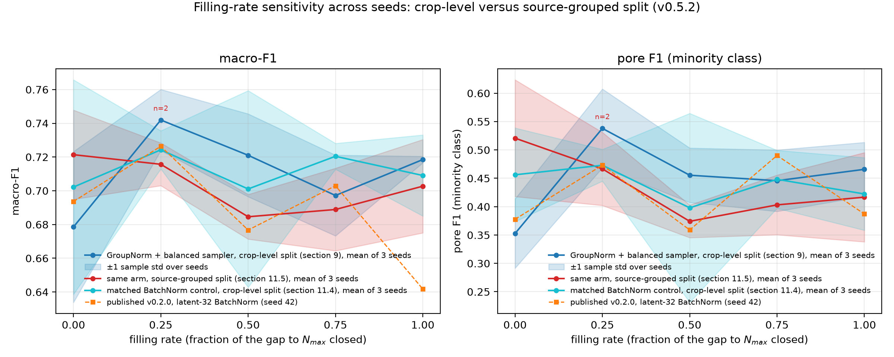

# 面向 WAAM 缺陷图像增广的 Hybrid CVAE-CGAN（非官方参考实现）

**语言 / Language:** [English](README.md) | 中文

[](LICENSE)
[](https://github.com/lijiawei255/hybrid-cvae-cgan-weld-augmentation/actions/workflows/smoke.yml)
[](https://www.python.org/)
[](https://pytorch.org/)
[](https://doi.org/10.1109/CYBER67662.2025.11168313)
[](https://doi.org/10.1016/j.ymssp.2026.114138)
[](https://doi.org/10.5281/zenodo.22645144)
[](CHANGELOG.md)

> **同步声明**：英文版 `README.md` 为规范版本（normative）。本中文版与其保持同步更新；若两者出现不一致，以英文版为准。

**维护状态：已完成 / 按现状提供。** 本仓库是一份已完成的参考实现，不再主动开发。Issue 可能无人回复；需要新功能请 [fork](CONTRIBUTING.md)，不要等待。已发布协议中的致命缺陷仍可能被修复。

这是 Yang 等人 hybrid CVAE-CGAN 协议的非官方、已完成参考实现。与原作者无关联。用它在公开焊缝数据上运行该方法，并引用原论文。本仓库不再主动开发。

> Junle Yang, Lei Yuan, Haochen Mu, Fengyang He, Donghong Ding, Zengxi Pan, Huijun Li, *"Generation of WAAM Defect Images Using a Hybrid CVAE-CGAN: A Data Augmentation Strategy for Small and Imbalanced Datasets"*, Proc. 15th IEEE Int. Conf. on CYBER Technology in Automation, Control, and Intelligent Systems (CYBER 2025), Shanghai, China, 15-18 July 2025. DOI: [10.1109/CYBER67662.2025.11168313](https://doi.org/10.1109/CYBER67662.2025.11168313)

会议论文省略的架构与超参细节，取自同一第一作者的期刊扩展：

> Junle Yang, Lei Yuan, Fengyang He, Zening Wu, Donghong Ding, Zengxi Pan, Huijun Li, *"Physics-guided generative data augmentation for vision-based signal processing under class-imbalanced conditions in directed energy deposition monitoring system"*, Mechanical Systems and Signal Processing, vol. 250, article 114138, 2026. **开放获取（CC BY 4.0）**：DOI: [10.1016/j.ymssp.2026.114138](https://doi.org/10.1016/j.ymssp.2026.114138)

该方法是**单个联合训练的 hybrid 模型**：同一个解码器同时是 CVAE 解码器 `D(z, y)` 与 CGAN 生成器 `G(z, y)`。训练最小化

```
L_G = MSE_recon  +  beta * KL  +  lambda * VGG19_perceptual  +  gamma * adversarial
```

更长的操作说明（期刊扩展开关、自有数据迁移、仓库结构、完整局限）见 [`docs/USAGE.md`](docs/USAGE.md)。与论文的实测偏离见 [`docs/CALIBRATION.md`](docs/CALIBRATION.md)。

## 快速事实

| | |
|---|---|
| **任务** | 面向小而失衡的焊缝缺陷图像数据集的类条件增广 |
| **方法** | 单个联合训练的 hybrid CVAE-CGAN：同一解码器同时是 `D(z, y)` 与 `G(z, y)`；MSE + KL + VGG19 感知 + hinge 对抗（spectral norm） |
| **数据** | 公开 LoHi-WELD 焊缝裁剪（论文使用专有 WAAM 熔池图像；结果不可比较） |
| **入口脚本** | `smoke_test.py` -> `train_joint.py` -> `generate.py` -> `train_classifier.py`（+ `eval_fid.py`），均在 `src/` |
| **主要结果** | balance-to-max（r=1.0）三 seed macro-F1 0.7185 ± 0.0019，较纯真实均值 +0.0399，**仅在裁剪级划分下成立**；按源图分组划分后增益不复存在（−0.0187，pore F1 −0.1041，三 seed；见[结果](#结果---lohi-weld当前)） |
| **状态** | 已完成 / 按现状提供；冻结参考实现，v0.5.2（[CHANGELOG](CHANGELOG.md)） |

## 目录

- [本仓库是什么、不是什么](#本仓库是什么不是什么)
- [范围一览](#范围一览)
- [免责声明](#免责声明)
- [快速开始](#快速开始)
- [数据](#数据)
- [结果 - LoHi-WELD（当前）](#结果---lohi-weld当前)
- [许可证](#许可证)
- [引用方式](#引用方式)

## 本仓库是什么、不是什么

本仓库是对 Yang 等人所述 hybrid CVAE-CGAN 训练与增广协议的**从零复现**。贡献在于别人不必再重写训练循环，也不必重新踩标定坑。与论文的每一处偏离都记录在 [`docs/CALIBRATION.md`](docs/CALIBRATION.md)。

它**不是**原作者的代码、通用图像生成库、持续运营的社区脚手架，或即插即用的工业工具。绝对数字与此处使用的公开替代数据（LoHi-WELD）以及从零训练的 ResNet-18 分类器绑定，不可与论文的专有结果比较。

## 范围一览

引用任何数字前请先读下面五层。

**论文方法（已实现）。** 单阶段 hybrid CVAE-CGAN：同一解码器同时是 `D(z, y)` 与 `G(z, y)`；联合 MSE + KL + VGG19 感知 + 对抗损失；Sub-Pixel 解码器；balance-to-max filling-rate 扫描。

**本仓库适配。** PyTorch 而非 TensorFlow/Keras。KL 权重按本仓库均值归一化的 [0, 1] 损失换算（latent 32 时 `0.015`，latent 128 时 `0.059`，对应论文 `beta = 30`）。对抗项是 hinge + spectral normalisation（期刊扩展），不是会议论文的 BCE。编码器卷积体是 4x4 stride-2 DCGAN 块，不是论文的 3x3 残差。下游分类器是单帧上从零训练的 ResNet-18。默认 FID 使用 [pytorch-fid](https://github.com/mseitzer/pytorch-fid)（官方 TensorFlow Inception 权重）。本仓库已发表的 FID 数字用的是旧的 torchvision 路径（`--fid_backend legacy`）。

**数据不等价。** 论文训练于专有可见光熔池图像（1,898 张、9 类）。本仓库使用公开 LoHi-WELD 焊缝裁剪，外加模拟的小而失衡 `--subset`。模态匹配；缺陷语义、相机几何与尺度不匹配。论文报告的数字因数据专有而无法被外部验证；本仓库的每一个数字都可基于公开数据端到端复现。

**不可与论文直接比较。** 准确率、F1、FID 绝对值、DR/MDR。LoHi-WELD 没有非缺陷类，因此 DR/MDR 在此不可定义。

**未完整复现。** 期刊 physics-guided 损失；21 帧时序增广与 LSTM/GRU 分类器；论文残差编码器体；期刊的 Charbonnier 重建损失、Tanh 解码器、projection 判别器与 free-bits KL；其 32→256 编码器通道宽度；FFT 去噪已实现但默认关闭。GroupNorm 现在可通过 `--d_norm` 与 `--g_norm` 用于每个网络，但只有判别器那一侧被测量过。逐条清单（含论文本身含糊、由本仓库自行决定的那些选择）见 [`docs/USAGE.md`](docs/USAGE.md#what-this-repo-deliberately-does-not-reproduce)。

## 免责声明

- 本仓库是**仅基于已发表论文的独立复现**，**与原作者及其机构无隶属、背书或任何关联**。
- 原作者的 WAAM 数据集为专有数据，本项目**未使用、未访问、未索取**。
- 所有实验均在**公开可获取、许可开放的数据集**上进行。各数据集自身许可适用。
- 本仓库不复制、也不声称论文中的**任何图像**与专有数据。期刊扩展以
  [CC BY 4.0](https://creativecommons.org/licenses/by/4.0/) 开放获取，
  [`docs/CALIBRATION.md`](docs/CALIBRATION.md) 第 8 节在该许可下带署名引用了
  其 Fig. 15(a) 的消融数值，用以说明本仓库没有复现其头条结果的哪一部分；
  会议论文的少量引文同理。
- 本项目复现的是*方法*，**不**声称复现论文的实验结果或报告数字。

## 快速开始

在 12 GB GPU 上，论文规模子集上推荐的 70-epoch 生成器大约需要**一小时**。五比例分类器扫描通常要几小时。冒烟测试只需几分钟。见 [`docs/USAGE.md`](docs/USAGE.md#compute-order-of-magnitude) 与 [`docs/CALIBRATION.md`](docs/CALIBRATION.md) 第 4 节计时表。

测试通过的 Python 版本为 3.11（CI 所用版本）；其他版本未测试。

```bash
pip install -r requirements.txt

# 合成数据自检——任何代码改动后都应先跑这个
python src/smoke_test.py

# 训练联合模型（推荐的 LoHi-WELD 配置）
# --patience/--lr_patience 70 关掉早停与学习率衰减，跑满 70 epoch，这是被测量的
# 那一版的做法。用默认值（10 与 5）时本次训练约在第 32 epoch 停止，得到的是
# 另一个生成器。
python src/train_joint.py --data_root data/lohi \
  --subset "pore=40,deposit=150,discontinuity=300,stain=600" --val_per_class 200 \
  --epochs 70 --batch_size 8 --img_size 224 --channels 3 --latent_dim 128 \
  --lr 1e-3 --lr_d 1e-3 --kl_weight 0.059 --perc_weight 0.1 --adv_weight 0.1 \
  --patience 70 --lr_patience 70 --d_norm group --weighted_sampler \
  --fid_every 5 --sample_every 10 \
  --out_dir runs/joint_lohi_recommended

# 生成 balance-to-max 池
python src/generate.py --ckpt runs/joint_lohi_recommended/joint.pt \
  --counts "pore=560,deposit=450,discontinuity=300,stain=0" --out_root generated

# 下游扫描：每个 filling rate 一个从零训练的分类器
# 下面每一张已发表的表格都用 --selection final 打分；当前默认值 best_val
# 选的是另一个 epoch。
python src/train_classifier.py --data_root data/lohi --gen_root generated \
  --subset "pore=40,deposit=150,discontinuity=300,stain=600" \
  --ratios "0.0,0.25,0.5,0.75,1.0" --channels 3 --epochs 100 \
  --selection final --out_dir runs/sweep

# 论文风格图，来自上面两次运行。仓库里已提交的图出自已发表的运行，
# 对应关系见下方出处表。
python src/make_paper_figures.py --data_root data/lohi \
  --ckpt runs/joint_lohi_recommended/joint.pt \
  --history runs/joint_lohi_recommended/history.csv \
  --sweep runs/sweep/sweep_metrics.csv --cm_dir runs/sweep \
  --subset "pore=40,deposit=150,discontinuity=300,stain=600" --channels 3 \
  --out_dir results

# 独立 FID（默认后端：pytorch-fid）
python src/eval_fid.py --real_root data/lohi --fake_root generated --channels 3
# 本仓库已发表的 FID 数字用的是：
#   python src/eval_fid.py --real_root data/lohi --fake_root generated --channels 3 --fid_backend legacy
```

会议论文默认（latent 32、BatchNorm、不加权采样）见 [`CHANGELOG.md`](CHANGELOG.md) 的 v0.2.0。期刊扩展开关、迁移到你自己的类文件夹图像、完整局限列表：[`docs/USAGE.md`](docs/USAGE.md)。

## 数据

当前实验使用 **[LoHi-WELD](https://github.com/SylvioBlock/LoHi-Weld)**（Block et al., IEEE Access 2024）：可见光焊缝图像、四个缺陷类，允许免费研究与商用、需引用。下载后只制备 `high_resolution_welds`：

```bash
python src/prepare_yolo_crops.py \
  --input_root <archive>/weld-dataset/high_resolution_welds \
  --out_root data/lohi --img_size 224 --channels 3 --min_side 16 \
  --classes "pore,deposit,discontinuity,stain"
```

这会生成 8,012 个裁剪块（deposit 1,193、discontinuity 2,975、pore 304、stain 3,540；失衡约 11.6×）。主实验使用其中的小 `--subset`，而非全部 8,012 张。224x224 画布高估了真实分辨率：源标注框中位约 47 px，因此几乎所有裁剪都是上采样（测量见 [`docs/CALIBRATION.md`](docs/CALIBRATION.md) 第 4 节）。

本仓库不打包任何数据集。`data/`、`generated/`、`runs/` 与 `*.pt` 按设计被 git-ignore。出处与许可见 [`DATA_SOURCES.md`](DATA_SOURCES.md)。RIAWELC 仅为历史脚注；其数字见 [`CHANGELOG.md`](CHANGELOG.md)（v0.1.0），请勿引用。

## 结果 - LoHi-WELD（当前）

本节按发布原样保留 v0.2.0 的单 seed 表格；表格后的三 seed 注记（v0.3.0 加入）是 r=1.0 结论的当前读法。

单 seed（42）。生成器：在论文规模子集（pore 40 / deposit 150 / discontinuity 300 / stain 600）上联合训练 CVAE-CGAN，70 epoch 中于第 25 epoch 早停（最佳 epoch 15）。诊断：FID 从 371 降至 216 后在 ~200 平台（仅作诊断，不可与任何已发表 FID 比较）；样图网格显示清晰的类形态。在最佳 epoch，该生成器的验证重建 MSE 为 0.0498（训练 0.0592），对照在它自己那 800 张验证集上实测的两个平凡预测器：常数全局均值为 0.0556，逐图自身均值为 0.0339。也就是说它越过了常数均值这条线，而**没有**达到逐图均值这条更严的线，并且 25 个 epoch 里只有 6 个低于常数均值。早先版本在此处写的常数均值基线 0.062 已更正；正确的一对是 [`docs/CALIBRATION.md`](docs/CALIBRATION.md) 第 6、9 节里的 0.0556 / 0.0339。

**Filling-rate 扫描**——每个 ratio 一个从零训练的 ResNet-18，各 100 epoch，全部在同一个 held-out 纯真实测试集（1,603 张）上评估（划分为**裁剪级**——实测 99.8–100% 的测试裁剪与训练池共享同一源图，见[局限列表](docs/USAGE.md#limitations)）：

| ratio | accuracy | macro-F1 | weighted-F1 | deposit | discontinuity | pore | stain |
|---|---|---|---|---|---|---|---|
| 0.00（仅真实） | 0.8222 | 0.6936 | 0.8177 | 0.6521 | 0.9145 | 0.3778 | 0.8301 |
| **0.25** | **0.8353** | **0.7264** | **0.8306** | 0.6727 | 0.9203 | 0.4731 | 0.8393 |
| 0.50 | 0.8178 | 0.6767 | 0.8078 | 0.6108 | 0.9097 | 0.3590 | 0.8273 |
| 0.75 | 0.8141 | 0.7029 | 0.8064 | 0.5957 | 0.8977 | **0.4902** | 0.8281 |
| 1.00（balance-to-max） | 0.7392 | 0.6418 | 0.7403 | 0.6199 | 0.7932 | 0.3871 | 0.7669 |

本节两张表都以 `--selection final` 打分、FID 以 `--fid_backend legacy` 计算；今天的默认值是 `best_val` 与 `pytorch_fid`，是不同的协议和不同的尺度。**在同一 seed 下重跑同一纯真实配置，macro-F1 最多变动 0.127、pore F1 最多变动 0.255**（三个 seed 上共八次重复，实测见 [`docs/CALIBRATION.md`](docs/CALIBRATION.md) 第 11.7 节；第 10 节报告的那一次重复 0.009 / 0.034 只是运气好），所以本表中任何单个逐比例差异，除非在多个 seed 上重复出现，都应读作噪声——包括表中的每一个差异。

两个按实测报告的发现：

1. **增广帮助少数类。** pore（304 张真实裁剪）在 r=0.25 获 +0.095 F1、r=0.75 获 +0.112；macro-F1 在 r=0.25 达峰，较仅真实基线 +0.033。
2. **论文的 balance-to-max 建议在这张单 seed 表上不迁移。** 此处 r=1.0 是最差比例。请把“填到 N_max”当作在你自己数据上待检验的假设，而非默认。

> **结论 2 已被部分取代，上方表格按发布原样保留。**
> 在三个彼此独立的生成器/生成池/分类器 seed 上，推荐配置
> （`--d_norm group --weighted_sampler`、`--latent_dim 128`、`--kl_weight 0.059`、
> 跑满 70 epoch）在 r=1.0 的 macro-F1 为 **0.7185 ± 0.0019**，相对
> 0.6785 ± 0.0447 的纯真实均值高 +0.0399；pore F1 为 **0.4658 ± 0.0475**，
> 高 +0.1132。这支持 r=1.0 的*平均*正向作用，但不支持单调曲线或 r=1.0
> 是唯一最优。匹配的 BatchNorm、未加权采样对照在 r=1.0 也有正向结果，
> 因此 GroupNorm 和加权采样**不是**符号反转的必要条件。完整表格、划分重叠测量与限制见
> [`docs/CALIBRATION.md`](docs/CALIBRATION.md) 第 9 节。

> **v0.5.2 新增：上面的增益在按源图分组的划分下不成立。**
> 同一推荐配置在三个 seed 上用 `--split_by source` 端到端重跑（生成器、生成池、
> 扫描），使任何一张 LoHi-WELD 源图都不会同时向训练池和 held-out 测试集供图。
> 此时 r=1.0 的 macro-F1 增量为 **−0.0187 ± 0.0252**（逐 seed +0.0065、−0.0186、
> −0.0439），pore F1 在每个 seed 上都于 r=1.0 下降（均值 **−0.1041**）；两项指标
> 上没有任何比例的三 seed 均值高于纯真实基线。纯真实基线本身并未下降（未见源图上
> 0.7214 ± 0.0265，对比上文 0.6785 ± 0.0447），所以裁剪级划分乐观的是*增广收益*，
> 而不是分类器。另外两组重跑修正上一条注记：匹配的 BatchNorm 对照补到三个 seed 后
> r=1.0 增量只有 +0.0069 macro-F1、pore F1 −0.0338，其单 seed 的"符号反转"撤回；
> 只开 GroupNorm 不开加权采样能复现判别器均衡和重建增益，但下游是最差的池
> （r=1.0 −0.0590，单 seed）。完整表格、五组已发表扫描按 `--selection best_val`
> 的重打分、两种 FID 尺度的并列，以及会议论文 BCE 目标在当前代码上的表现，见
> [`docs/CALIBRATION.md`](docs/CALIBRATION.md) 第 11 节。图：
> `results/filling_rate_multiseed_v052.png`。

`results/` 中的图。**每张图都属于某一次特定运行**，而且只有第一行能仅凭本仓库已提交的内容重画；其余需要生成器 checkpoint 或原始运行目录里的逐比例混淆矩阵，而那些目录被 gitignore（见[可复现性](#可复现性)）：

| 图 | 由哪次运行产出 | 能否在此重画 |
|---|---|---|
| `filling_rate_multiseed_v052.png` | 同一三 seed 扫描，对比其源图分组重跑与三 seed BatchNorm 对照（v0.5.2 注记） | 能，仅凭 `results/metrics/` |
| `filling_rate_multiseed.png` | 上文三 seed GroupNorm + 加权采样扫描 | 能，仅凭 `results/metrics/` |
| `filling_rate_curve.png` | 已发布的 v0.2.0 单 seed 扫描（`runs/sweep`） | 能，仅凭 `results/metrics/` |
| `confusion_matrices.png`（r=0 vs r=1）、`class_distribution.png` | 已发布的 v0.2.0 扫描 | 能，仅凭 `results/metrics/` |
| `training_curves.png` | 已发布的 v0.2.0 生成器（`runs/joint_lohi`） | 能，仅凭 `results/metrics/` |
| `reconstruction_comparison.png`、`latent_tsne.png` | 已发布的 v0.2.0 生成器（`runs/joint_lohi`） | 需要该 checkpoint |
| `real_vs_generated.png`、`class_*.png` | 推荐的 `runs/paper2_gn_wrs` 生成器 | 需要该 checkpoint |

复现命令：第一行见 `docs/CALIBRATION.md` 第 11 节，第二行与最后一行见第 9 节。这些图背后的原始指标导出（扫描与训练历史 CSV，以及逐比例混淆矩阵 `cm_r*.npy`）发布在 [`results/metrics/`](results/metrics/README.md) 下，每个运行名一个子目录，因此仅需 CSV 的那些图无需原始运行目录即可复现。

### 可复现性

本仓库带什么、不带什么：

| 产物 | 是否随仓库分发 | 对你意味着什么 |
|---|---|---|
| 每个已发表数字背后的指标 | 是，`results/metrics/` | 无需 GPU 即可核对全部表格 |
| 逐比例混淆矩阵（`cm_r*.npy`） | 是，`results/metrics/` | `confusion_matrices.png` 无需重训即可重画 |
| 生成器 checkpoint（`joint.pt`） | 不在 git 里，过大 | 图与第 9、11 节扫描背后的全部 11 个 checkpoint 作为附件挂在 Zenodo 记录上，SHA-256 列于 [`release_assets/MANIFEST.md`](release_assets/MANIFEST.md)；否则需自行重训 |
| 生成图像池 | 不在 git 里 | 12 个扫描与 showcase 池以 zip 附在 Zenodo 记录上（同一清单）；或用 `src/generate.py` 从 checkpoint 重新生成 |
| LoHi-WELD 数据本身 | 否 | 自行下载后运行 `src/prepare_yolo_crops.py` |

确切环境：`requirements.txt` 给出受支持的版本范围，`requirements-lock.txt` 钉住产出这些结果时的确切版本。即便固定 seed，GPU 结果也不是逐比特可复现的（[`docs/CALIBRATION.md`](docs/CALIBRATION.md) 第 10 节）。


阴影带是三个 seed 上的 ±1 样本标准差；`n=2` 标记 r=0.25，该比例下 seed 42 那一臂因最后 epoch 的 loss 尖峰被排除。这张图支持的是裁剪级划分下 r=1.0 的结论，而不是三种配置逐比例的排序。



v0.5.2 的图加入了同一臂在源图分组划分下的曲线（红）和三 seed 的 BatchNorm 对照（青）。只有裁剪级曲线在两个面板上都于 r=1.0 明显高于自己的纯真实基线；对照在该点 macro-F1 仅 +0.0069、pore 为负，源图分组曲线两项都为负。

**已提交的 LoHi-WELD showcase。** 来自推荐生成器 `runs/paper2_gn_wrs/joint.pt` 的定性示例。特写上的按类 FID 只是仓库内部诊断量，不可与文献比较。v0.2.0 旧版本保留为 `results/v0.2.0_*.png`。


| deposit | discontinuity |
|---|---|
|  |  |
| pore | stain |
|  |  |

已发表表格使用 `--selection final`。当前分类器默认是 `--selection best_val`。下游模型是单帧上从零训练的 ResNet-18，而非论文的 LSTM/GRU。完整注意事项见 [`docs/USAGE.md`](docs/USAGE.md#limitations) 与 [`docs/CALIBRATION.md`](docs/CALIBRATION.md) 第 10 节。

## 许可证

代码：[MIT](LICENSE)。默认 FID 后端依赖
[pytorch-fid](https://github.com/mseitzer/pytorch-fid)（Apache-2.0），见
[NOTICE](NOTICE)。第三方数据集保留其自身许可。`results/` 中已提交的图由 LoHi-WELD 影像派生，因此仍受该数据集引用要求约束。

## 引用方式

如果本复现对你的工作有帮助，请引用**原始论文**与**数据集**而不是本仓库。[`CITATION.cff`](CITATION.cff) 列两组：被复现论文加每个数据集的强制引用，以及实现组件引用（FID、t-SNE、InceptionV3、ResNet-18、VGG19）。本仓库的各版本快照存档于 Zenodo：[10.5281/zenodo.22645144](https://doi.org/10.5281/zenodo.22645144)（concept DOI，解析到最新版本）。

```bibtex
% --- 主方法参考（被复现的会议论文）---
@inproceedings{yang2025hybridcvaecgan,
  title     = {Generation of WAAM Defect Images Using a Hybrid CVAE-CGAN:
               A Data Augmentation Strategy for Small and Imbalanced Datasets},
  author    = {Yang, Junle and Yuan, Lei and Mu, Haochen and He, Fengyang and
               Ding, Donghong and Pan, Zengxi and Li, Huijun},
  booktitle = {Proc. 15th IEEE International Conference on CYBER Technology
               in Automation, Control, and Intelligent Systems (CYBER 2025)},
  address   = {Shanghai, China},
  month     = jul,
  year      = {2025},
  pages     = {1--6},
  doi       = {10.1109/CYBER67662.2025.11168313}
}

% --- 次要方法参考（期刊扩展；提供会议论文省略的细节）。CC BY 4.0 开放获取。---
@article{yang2026physicsguided,
  title   = {Physics-guided generative data augmentation for vision-based
             signal processing under class-imbalanced conditions in directed
             energy deposition monitoring system},
  author  = {Yang, Junle and Yuan, Lei and He, Fengyang and Wu, Zening and
             Ding, Donghong and Pan, Zengxi and Li, Huijun},
  journal = {Mechanical Systems and Signal Processing},
  volume  = {250},
  pages   = {114138},
  year    = {2026},
  doi     = {10.1016/j.ymssp.2026.114138}
}

% --- 以下两条 RIAWELC 引用是该数据集的强制使用条款 ---
@inproceedings{totino2022riawelc,
  title     = {RIAWELC: A Novel Dataset of Radiographic Images for
               Automatic Weld Defects Classification},
  author    = {Totino, Benito and Spagnolo, Fanny and Perri, Stefania},
  booktitle = {Proc. Interdisciplinary Conference on Mechanics, Computers
               and Electrics (ICMECE 2022)},
  address   = {Barcelona, Spain},
  month     = oct,
  year      = {2022}
}

@article{perriweldingdefects,
  title   = {Welding Defects Classification Through a Convolutional
             Neural Network},
  author  = {Perri, Stefania and Spagnolo, Fanny and Frustaci, Fabio and
             Corsonello, Pasquale},
  journal = {Manufacturing Letters},
  volume  = {35},
  pages   = {29--32},
  year    = {2023},
  doi     = {10.1016/j.mfglet.2022.11.006}
}

% --- 作为主实验的可见光焊缝缺陷数据集 ---
@article{block2024lohiweld,
  title   = {LoHi-WELD: A Novel Industrial Dataset for Weld Defect Detection
             and Classification, a Deep Learning Study, and Future
             Perspectives},
  author  = {Block, Sylvio Biasuz and Dutra da Silva, Ricardo and
             Lazzaretti, Andre Eugenio and Minetto, Rodrigo},
  journal = {IEEE Access},
  volume  = {12},
  pages   = {77442--77453},
  year    = {2024},
  doi     = {10.1109/ACCESS.2024.3407019}
}
```
